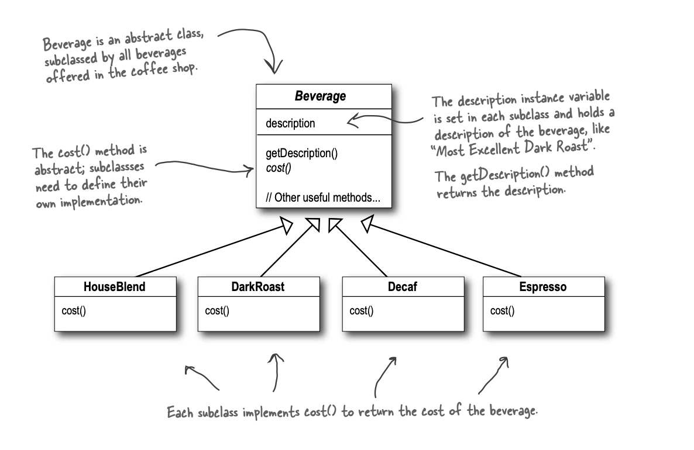
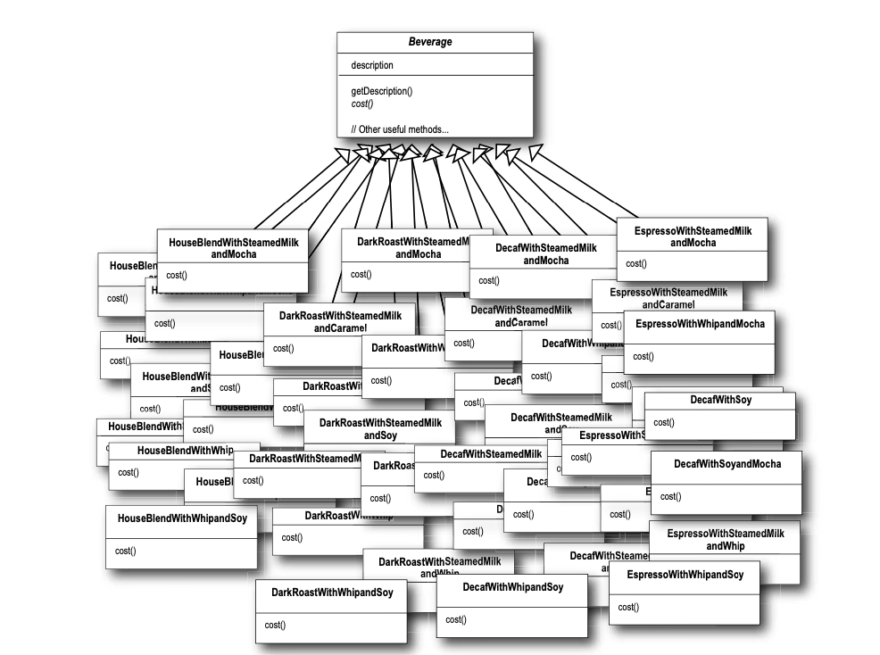
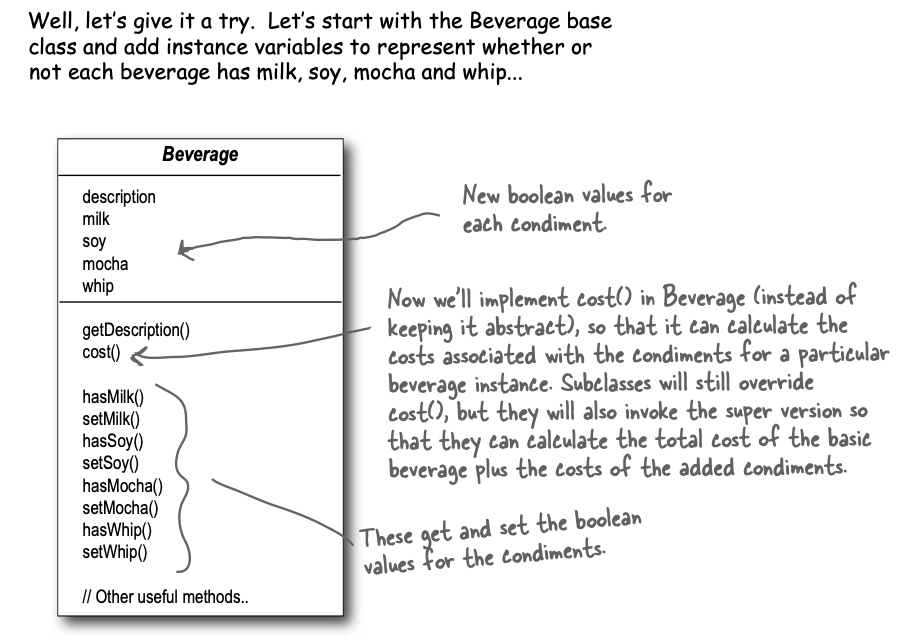
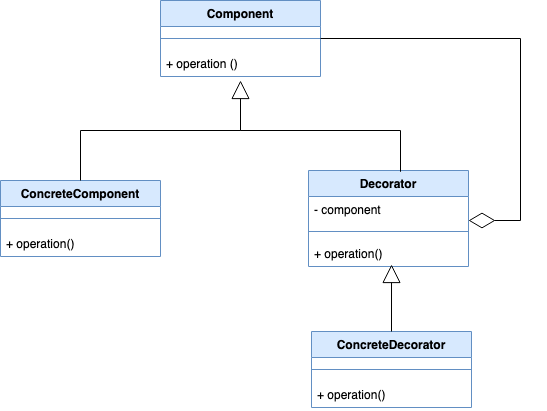

### Example
Imagine you are running a coffee shop and you offer 4 types of coffee namely Houseblend, DarkRoast, Decaf, Espresso each with different cost.
There are also condiments like mocha(chocolate), milk, whip etc which affect the final cost of coffee. Customer can request a mocha DarkRoast or whip HouseBlend.


So if we go with sub-classing then it'll lead to class explosion as there will be many combinations.



What can be the solution to this?

We can try making condiments as instance variables and then based on what condiments used we can calculate the cost.



But the above approach leads to ugly code to calculate cost and sometimes it does not even make sense like if we add IcedTea as 5th beverage then checking for whip is illogical.

So the best way to solve this problem is With the use of decorator pattern.
Base beverage will be wrapped/enriched in decorators/condiments to produce the final beverage.
Below code shows how the clients will create different beverage combinations using decorators.
```
    Beverage doubleMochaDarkRoast = new Mocha(new Mocha(new DarkRoast)));
    Beverage espressoWithSoyAndWhip = new Whip(new Soy(new Espresso()));
```
Cost is calculated using delegation.
```
public class Mocha extends CondimentDecorator { 
    Beverage beverage;
    public Mocha(Beverage beverage) { 
        this.beverage = beverage;
    }
    public String getDescription() {
        return beverage.getDescription() + “, Mocha”;
    }
    public double cost() {
        return .20 + beverage.cost();
    }
}
```

### Structure of Decorator Pattern
The main components of the Decorator Pattern include:
Component Interface: This is the foundational interface for all pattern objects, defining the default behavior that decorators can add to.
Concrete Component: A particular Component Interface implementation. This is the target to which additional responsibilities can be applied.
Decorator Interface: An abstract class or interface that 'wraps' a component to give it extra features. It usually implements the same interface and stores a reference to an object representing a Component Interface.
Concrete Decorator: These are the classes that give the decorated objects extra functions. They put the extra behaviors into practice and expanded the Decorator Interface.

